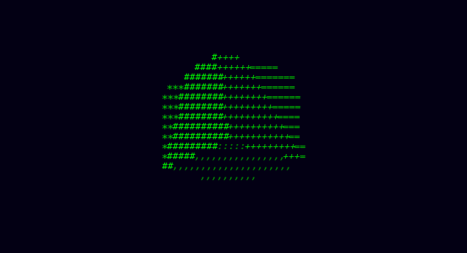

  <h1>ASCII 3D Cube</h1>
  
<strong>A tiny, dependency-free 3D renderer for your terminal.</strong>

  

    
    
    
  

  

    
  

ASCII 3D Cube demonstrates the fundamentals of a software 3D pipeline using
only Python and terminal characters—no runtime dependencies required.

## Highlights

- Perspective projection with character-aspect correction
- Filled triangle rasterization and per-cell z-buffering
- Directional lighting, depth shading, and ANSI color
- Flicker-free, terminal-aware animation on macOS, Linux, and Windows

## Quick start

~~~bash
git clone https://github.com/msadeqsirjani/ascii-3d-cube.git
cd ascii-3d-cube
python main.py
~~~

Press <kbd>Ctrl</kbd> + <kbd>C</kbd> to exit. Your original terminal screen and
cursor are restored automatically.

## Install

~~~bash
python -m pip install .
ascii-cube
~~~

You can also run the installed package with:

~~~bash
python -m ascii_3d_cube
~~~

## Options

| Option | Description | Default |
| --- | --- | ---: |
| **--width** | Maximum canvas width | 80 |
| **--height** | Maximum canvas height | 30 |
| **--fps** | Target frames per second | 30 |
| **--speed** | Rotation speed | 0.05 |
| **--no-color** | Disable ANSI colors | off |

~~~bash
ascii-cube --width 100 --height 36 --fps 60
ascii-cube --no-color
~~~

## How it works

Every frame rotates eight vertices in 3D space, perspective-projects them onto
terminal cells, and rasterizes twelve triangles with barycentric coordinates.
A z-buffer resolves visible surfaces, while directional lighting selects each
cell's character density and color.

## Development

~~~bash
python -m pip install -e ".[dev]"
ruff check .
pytest
~~~

See [CONTRIBUTING.md](CONTRIBUTING.md) for the contribution workflow.

Regenerate the demo

Install [ImageMagick](https://imagemagick.org), then render the GIF directly
from the application:

~~~bash
python scripts/generate_demo.py
~~~

## License

Released under the [MIT License](LICENSE).
