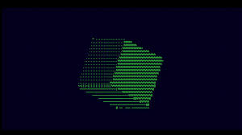

# 🎲 ASCII 3D Cube Renderer

A Python-based 3D cube renderer that displays a rotating cube using ASCII characters in the terminal. This project demonstrates 3D graphics principles using nothing but text characters! 

## ✨ Features

- 🔄 Smooth 3D rotation around all axes
- 📏 Perspective projection
- 🎨 Depth perception using different ASCII characters
- 💾 Z-buffer implementation for proper depth handling
- 🖥️ Cross-platform terminal rendering

## 🎯 Demo

Here's how the cube looks in action:



## 🚀 Installation

1. Clone the repository:

```bash
git clone https://github.com/msadeqsirjani/ascii-3d-cube.git
```

2. Install dependencies:

```bash
pip install -r requirements.txt
```

## 💻 Usage

Run the demo:

```bash
python main.py
```


### 🎮 Controls
- `Ctrl+C` to exit the animation

## 🏗️ Project Structure

```bash
ascii-cube/
│
├── src/
│   ├── __init__.py
│   │
│   ├── core/
│   │   ├── __init__.py
│   │   ├── cube.py          # Cube geometry and transformations
│   │   └── renderer.py      # Enhanced ASCII rendering with colors
│   │
│   ├── utils/
│   │   ├── __init__.py
│   │   └── screen.py        # Screen handling and ANSI support
│   │
│   └── config/
│       ├── __init__.py
│       └── settings.py      # Configuration parameters
│
├── tests/
│   ├── __init__.py
│   ├── test_cube.py
│   └── test_renderer.py
│
├── examples/
│   └── simple_rotation.py   # Basic rotation example
│
├── main.py                  # Main application file
│
├── requirements.txt         # Project dependencies
├── README.md               # Project documentation
├── LICENSE                 # MIT License
└── .gitignore             # Git ignore file
```

## 🔧 Technical Details

### 3D Rotation
The cube implements full 3D rotation using rotation matrices:

```python
def rotate_point(self, point: List[float], angle_x: float, angle_y: float, angle_z: float) -> List[float]:
# Rotation implementation...
```


### Depth Perception
Characters are selected based on Z-depth:

```python
def get_char_from_depth(self, depth: float) -> str:
# Character selection implementation...
```


## 🧪 Testing
Run the test suite:

```bash
pytest
```


## 📊 Performance

The renderer achieves real-time performance with:
- Screen size: 60x30 characters
- Refresh rate: ~20 FPS
- Memory usage: < 10MB

## 🛠️ Customization

Modify `src/config/settings.py` to adjust:
- Screen dimensions
- Animation speed
- Depth characters
- Projection parameters

Example:

```python
SCREEN_WIDTH = 60
SCREEN_HEIGHT = 30
ROTATION_SPEED = 0.05
```


## 🤝 Contributing

1. Fork the repository
2. Create your feature branch (`git checkout -b feature/amazing-feature`)
3. Commit your changes (`git commit -m 'feat: Add amazing feature'`)
4. Push to the branch (`git push origin feature/amazing-feature`)
5. Open a Pull Request

## 📝 License

This project is licensed under the MIT License - see the [LICENSE](LICENSE) file for details.
